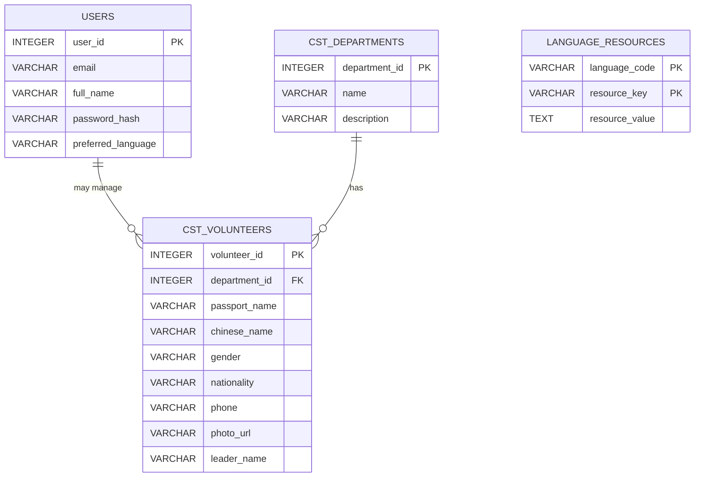
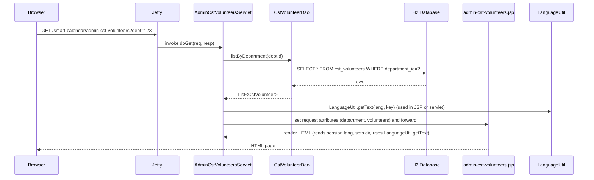

# Smart Calendar — Project Report

**Contents**

- Project summary
- Technology stack
- Architecture (overview + Mermaid diagram)
- Data model (ER diagram + important tables)
- Request lifecycle & component interactions (sequence diagram)
- Internationalization (i18n) design and how it works
- Key pages and server-side flows (Admin Volunteers example)
- Deployment & run instructions
- Testing and QA checklist
- Recommendations and next steps

---

## Project summary

Smart Calendar is a Java web application (WAR) providing calendar, event management, admin tools, and volunteer management (CST) features. It uses servlets + JSP for UI, simple JDBC DAOs for persistence, and an H2 database for development. The codebase already contains a lightweight language system using a `LanguageUtil` class and a `/set-language` servlet.

This report explains how the application is structured, how a browser request flows through the server, how translations are handled, and how to run and test the app locally. Diagrams are provided using Mermaid so you can paste them into any Markdown viewer that supports Mermaid or into mermaid.live.

---

## Technology stack

- Java 11
- Jakarta/Servlet API (via Jetty 11)
- JSP + JSTL-style usage (some pages use raw scriptlets and custom `LanguageUtil` calls)
- Maven for build
- Jetty Maven plugin for local running (`mvn -Djetty.port=8082 jetty:run` pattern used)
- H2 in-memory database for development; initialization via `src/main/resources/sql/init.sql`
- Plain CSS/JS for client side

---

## High-level architecture

Mermaid architecture diagram (browser → webapp → DB / components):

```mermaid
flowchart TD
  Browser[Browser (user)] -->|HTTP GET/POST| Jetty[Jetty Web Server]
  Jetty --> WebApp[Web Application (WAR)]
  subgraph App
    WebApp --> ServletLayer[Servlets]
    ServletLayer --> JSPs[JSP Views]
    ServletLayer --> DaoLayer[DAO (JDBC)]
    DaoLayer --> H2[H2 Database]
    ServletLayer --> LanguageUtil[LanguageUtil (cache) — language_resources]
  end
  Browser -->|Static| Static[css/, js/, images/]
  WebApp --> Static

  style Browser fill:#fef3c7
  style Jetty fill:#e0f2fe
  style WebApp fill:#ecfccb
  style H2 fill:#fee2e2
```

**Notes:**
- The webapp is packaged as a WAR and Jetty serves the webapp with context `/smart-calendar` in local dev.
- Servlets accept requests, call DAOs to fetch or persist data, set request attributes, and forward to JSPs which render HTML.

---

## Data model (ER diagram)

This project uses a few core tables. The `language_resources` table is used for i18n keys.



**Important tables**
- `users` — stores the user identity and a `preferred_language` column used to default site language if present.
- `cst_departments`, `cst_volunteers` — used by admin pages for volunteer management.
- `language_resources` — contains key/value translations; loaded once into `LanguageUtil` (cache) at runtime.

---

## Request lifecycle & component interactions

Below is a sequence diagram for a typical "View Volunteers for Department" request (admin clicking "Manage Volunteers") that illustrates how servlets, DAOs and JSPs interact.



**Form submissions (save/update/delete)**: POST to the same servlet or other admin servlet; server does multipart handling for file upload (photo), calls DAO.update/insert/delete and redirects back.

---

## Internationalization (i18n) design and how it works

The codebase already contains a custom, DB-backed i18n approach centered on `LanguageUtil` and a `LanguageServlet`:

- `LanguageUtil` (class `com.smartcalendar.utils.LanguageUtil`) loads language key-value pairs from table `language_resources` (columns: `language_code`, `resource_key`, `resource_value`) into an in-memory `Map<String,Map<String,String>>` on first access. It exposes:
  - `getText(languageCode, key)` — returns translated string or a humanized fallback
  - `isSupportedLanguage(code)` — checks supported codes (en, ar, zh, fr)
  - `getTextDirection(code)` — returns `rtl` for `ar`, otherwise `ltr`

- `LanguageServlet` handles `/set-language` POST (and we added GET earlier). It stores the chosen `lang` in `session.setAttribute("lang", lang)` and also optionally updates `users.preferred_language` when a user is logged in.

- JSP pages read `lang` from session or fall back to `user.getPreferredLanguage()` if available. They pass `lang` to `LanguageUtil.getText(lang, key)` to render localized strings and set `<html lang="<%= lang %>" dir="<%= LanguageUtil.getTextDirection(lang) %>">` for RTL support.

### How to add / update translations

The source of truth is the DB table `language_resources`. Example SQL to add a key:

```sql
INSERT INTO language_resources (language_code, resource_key, resource_value)
VALUES ('en', 'nav.logout', 'Logout');

INSERT INTO language_resources (language_code, resource_key, resource_value)
VALUES ('ar', 'nav.logout', 'تسجيل الخروج');

INSERT INTO language_resources (language_code, resource_key, resource_value)
VALUES ('zh', 'nav.logout', '登出');

INSERT INTO language_resources (language_code, resource_key, resource_value)
VALUES ('fr', 'nav.logout', 'Se déconnecter');
```

After inserting/updating keys you can call `LanguageUtil.refreshResources()` (the servlet already calls this after language changes); a server restart would also reload.

**Note:** The project does not use standard `ResourceBundle` files; it uses a DB table approach. That is fine, but you should make sure the initialization script (`src/main/resources/sql/init.sql`) contains initial keys for the languages you need.

---

## Key pages and server-side flows (Admin Volunteers example)

The `admin-cst-volunteers.jsp` page is backed by `AdminCstVolunteersServlet`.

High-level flow when an admin opens the volunteers page:

1. Browser GET `admin-cst-volunteers?dept=<id>`
2. `AdminCstVolunteersServlet#doGet`:
   - Validates user and admin access
   - Reads department id
   - Calls `CstVolunteerDao.listByDepartment(deptId)`
   - Puts `department` and `volunteers` into request attributes and forwards to JSP
3. `admin-cst-volunteers.jsp` reads `lang` from session/user, sets `<html dir>` accordingly, and renders a two-column UI with the left listing and right edit panel (client-side `showVolunteerDetail(id)` fills the detail panel using a JS template and the JSON of volunteers)
4. Edits are submitted via POST to the servlet (multipart for photo) which uses `CstVolunteerDao.update()` or `insertReturningId()`; servlet then redirects back to the list view

**Important implementation notes found in the codebase:**
- Avoid mixing server-side JSP EL (e.g., `${...}`) and client-side template literals that also use `${...}` — this caused JSP compile errors in development. The current page either disables JSP EL parsing for the file (`isELIgnored="true"`) or pre-renders server values into JS variables (e.g., `const departmentId = <%= d.getId() %>;`).
- Photo uploads handled in servlet helper method `handlePhotoUpload` — files saved to server file system and `photo_url` stored in DB.

---

## Deployment & run instructions (local dev)

1. Build the project (from repo root):

```bash
mvn -DskipTests package
```

2. Run with Jetty on port 8082 (project uses context `/smart-calendar`):

```bash
mvn -Djetty.port=8082 jetty:run
```

3. Open the app in the browser:

```
http://localhost:8082/smart-calendar
```

4. Language switching:
- Use the language select in the header (the site already has a select that posts to `/set-language`) or click a direct link like `/smart-calendar/set-language?lang=ar` (we added GET handling to `LanguageServlet`).
- After selecting a language the session stores `lang` and pages rendered after will use that language when `LanguageUtil.getText(lang, key)` is used in JSPs.

---

## Testing and QA checklist

- Functional:
  - [ ] Login as admin and non-admin user; ensure redirects for unauthorized pages work.
  - [ ] Open `admin-cst-volunteers` for a department: list must show volunteers; clicking a volunteer loads editable details on the right.
  - [ ] Edit details, upload a photo, and save — verify DB row updated and photo link resolves.
  - [ ] Delete a volunteer and confirm removal.
  - [ ] Language switching via select / GET link: verify UI text (title, nav, labels) changes.

- i18n QA:
  - [ ] Check `dir="rtl"` applied when `lang=ar` and verify layout is usable (flip alignment where needed).
  - [ ] Verify `LanguageUtil.getText` fallback: missing keys fallback to English then to humanized key.
  - [ ] Insert new keys into `language_resources` and refresh resources; verify display updates.

- Security & robustness:
  - [ ] Validate file upload size/type restrictions (photo).
  - [ ] Verify prepared statements in DAOs to avoid SQL injection.
  - [ ] Check session timeout and logout flows.

---

## Recommendations & next steps

1. Move i18n keys into property files or keep DB but provide a management UI so non-developers can edit translations.
2. Replace JSP scriptlets with JSTL/fmt tags or a small wrapper to call `LanguageUtil.getText` in a cleaner way; this reduces risk of injection and improves maintainability.
3. Add automated UI tests that switch languages and validate key views render correctly (Selenium or Playwright).
4. Add a small CSS direction utility and test RTL thoroughly; consider mirroring layout using logical CSS properties (start/end, margin-inline-start) for easier RTL support.
5. Provide an "Add volunteer" modal or separate page to reintroduce that flow where needed (page currently shows list + detail only).

---

## Appendix: Useful SQL examples

Create `language_resources` row:

```sql
INSERT INTO language_resources (language_code, resource_key, resource_value) VALUES
('en','app.title','Smart Calendar'),
('ar','app.title','التقويم الذكي'),
('zh','app.title','智能日历'),
('fr','app.title','Agenda Intelligent');
```

Refresh translations at runtime (example using H2 console or code):

```java
// from a servlet or admin UI
com.smartcalendar.utils.LanguageUtil.refreshResources();
```

---

## Files referenced

- `src/main/java/com/smartcalendar/servlets/LanguageServlet.java` — handles `/set-language`
- `src/main/java/com/smartcalendar/utils/LanguageUtil.java` — DB-backed i18n cache
- `src/main/webapp/admin-cst-volunteers.jsp` — volunteers management (list + detail)
- `src/main/java/com/smartcalendar/dao/CstVolunteerDao.java` and `CstDepartmentDao.java`
- `src/main/resources/sql/init.sql` — DB initialization

---

If you want, I can:
- Convert `admin-cst-volunteers.jsp` labels to use `LanguageUtil.getText(...)` for all keys.
- Add a central header include with language buttons and style RTL toggles.
- Populate `language_resources` with an initial English / Arabic / Chinese / French translation set for the admin pages.

Tell me which next action you want and I'll implement it. 
